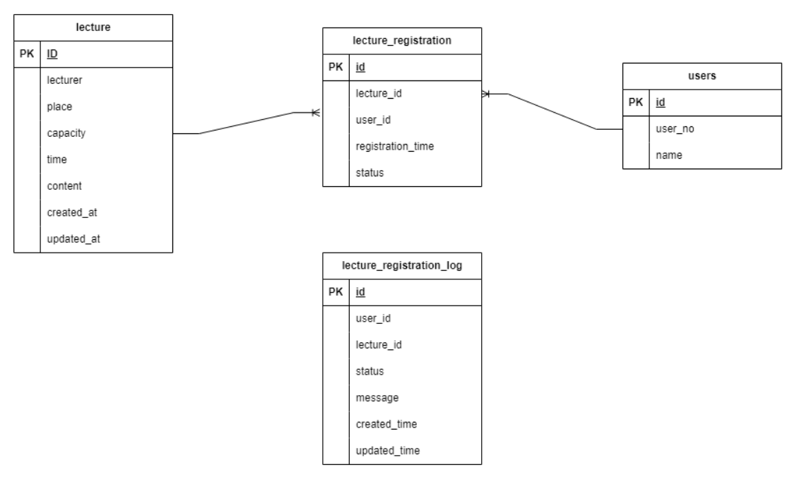
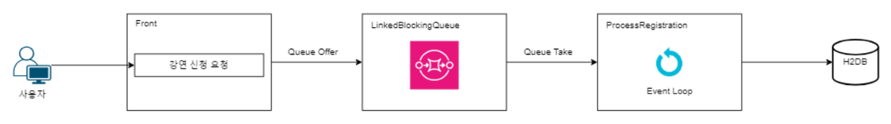

# kstd-assignment

키다리스튜디오 백엔드 개발자 기술 과제 Restful-API 개발(강연 신청 플랫폼 설계 및 API 개발)

- 회사에서 직원들의 경험을 위해 유명 강연자를 초빙한 강연을 준비
  다만, 강연장의 크기 때문에 인원 수를 제한하였고 강연 참여 신청을 받아 강연을 진행하려고 한다.
  지원자는 강연 신청 플랫폼의 Backend 개발자로 참여하게 되었으며, 설계 및 API 개발을 진행한다.

## 프로젝트 구성

| 기술스택    | 버전   | 비고                                                         |
| ----------- | ------ | ------------------------------------------------------------ |
| Spring Boot | 3.3.4  |                                                              |
| JDK         | 21     |                                                              |
| gradle      | 8.8    |                                                              |
| DB          | H2     | 개발 및 테스트 단계에서 별도 데이터베이스 서버를 <br />구축하지 않아도 독립적으로 개발하고 테스트 가능하므로 H2 사용 |
| Swagger-UI  | 2.2.22 |                                                              |

## Swgger-ui 

```http
http://localhost:8080/swagger-ui/index.html
```

## 데이터 설계



## API 목록

- BackOffice

  - 강연 목록 (전체 강연 목록)
  - 강연 등록(강연자, 강연장, 신청 인원, 강연 시간, 강연 내용 입력)
  - 강연 신청자 목록(강연 별 신청한 사번 목록)

- Front

  - 강연목록(신청 가능한 시점부터 강연 시작 시간 1일 후까지 노출)
  - 강연 신청(사번 입력, 같은 강연 중복 신청 제한)
  - 신청 내역 조회 (사번입력)
  - 신청한 강연 취소
  - 실시간 인기 강연

## 



- ### 동시성 문제 해결 및 데이터 일관성 보장

  > **강연 신청 시 동시적으로 많은 사용자가 몰릴 수 있는 상황을 고려하여, 큐를 사용하여 비동기적으로 신청을 처리하도록 설계.**
  >
  > - **동시성 이슈 해결**: 다수의 사용자가 동시에 강연 신청을 시도할 경우, 서버의 부하가 급증하거나 데이터베이스에 경합이 발생할 수 있다. 
  >   이를 방지하기 위해 요청을 `LinkedBlockingQueue`에 적재하여 순차적으로 처리하고, 동시성 문제를 해결했다.
  > - **데이터 일관성 보장**: 비동기 처리로 인해 작업이 완료되기 전에 시스템 오류가 발생하면 데이터의 일관성이 깨질 수 있다. 이를 방지하기 위해 큐에 요청을 적재할 때 로그를 데이터베이스에 저장하여, 큐의 현재 상태를 추적하고, 시스템이 재시작되거나 장애가 발생할 경우 DB에 저장된 큐 상태를 기반으로 복구 작업을 수행할 수 있도록 했다.

- ### 사용자 경험 개선

  > **사용자 경험**: 비동기의 특성상 사용자가 강연 신청 시 큐에 요청을 넣고 즉시 응답을 반환하므로, 지연 없이 빠른 응답을 받을 수 있다. 사용자는 즉시 응답을 받음으로써 신청 프로세스가 빠르게 진행된다고 느낄 수 있다.
  >
  > - **상태 추적**: 이후 클라이언트에서 폴링(Polling)을 통해 현재 신청 상태를 확인할 수 있도록 구현하여, 강연 신청의 성공 여부와 처리 상태를 사용자가 실시간으로 확인할 수 있게 했다.

- ### 확장성 고려

  > **확장성**: 현재는 `LinkedBlockingQueue`를 사용하여 단일 서버 내에서 요청을 처리하고 있다. 하지만, 향후 시스템이 확장되고 다수의 서버가 추가될 경우, 분산 환경에서 더 높은 확장성과 데이터 처리 능력을 제공하는 **`Kafka`**와 같은 메시지 브로커로 전환하는 것을 고려하고 있다.
  >
  > - **Kafka 도입 가능성**: Kafka는 분산 메시지 큐로서 데이터의 순서 보장 및 내구성을 제공하며, 다수의 서버에 걸쳐 동시성 처리를 효율적으로 관리할 수 있어 대규모 시스템에서도 안정적으로 동작할 수 있습니다.

- ### 시스템 안정성 및 장애 복구

  > **시스템 안정성**: 큐에 요청이 적재될 때마다 그 상태를 데이터베이스에 기록하여 시스템의 상태를 지속적으로 모니터링할 수 있습니다. 이를 통해 서버 재시작 시에도 이전 상태를 복원하고, 장애 발생 시 빠르게 복구할 수 있는 기반을 마련하다.
  >
  > - **장애 복구**: 시스템이 재시작되거나 장애가 발생하면, 데이터베이스에 저장된 큐 상태 로그를 기반으로 작업을 재개할 수 있다. 
  >   예를 들어, `PROCESSING` 상태로 남아 있는 요청을 다시 큐에 적재하거나, 실패한 요청(`FAILED`)을 별도로 관리하여 재처리할 수 있도록 설계하였다.
